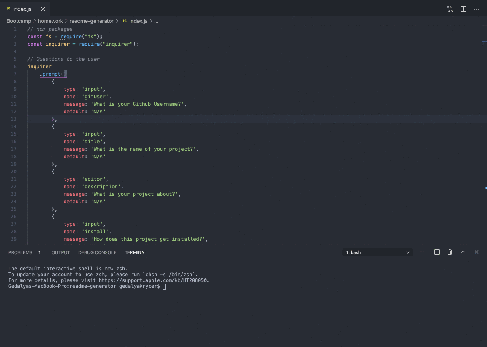

# CLI README Generator

## Description
In this project I created a README generator that uses node.js and the CLI to collect user information and outputs an `.md` file. 

* Uses `fs` and `inquirer` npm packages 

* Features a default of **N/A** if a question is not answered

* Uses **Template Literals** to create the foundation of the readme and then dynamically updates key sections with the user data

* Features a badge

* Features an anchor-linked Table of Contents

* Included sections that the user can fill out are:
     
     * GitHub Username
     * Project Name
     * Project Description 
     * Installation Requirements
     * Usage Information 
     * Licensing Information 
     * Contributors 
     * Tests 
     * Questions 

---

## Installation 

Running this program requires…

* Node.js

* npm 

* `fs` package

* `inquirer` package

---

## Demo 

